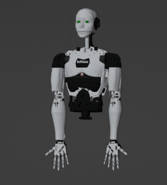

# Robot Niko
**Humanoid Robot Using Raspberry PI**

## Features:
- [ ] **Robot Voice**
  - [ ] WakeWord
  - [X] Listening
  - [X] Speaking
  - [X] Custome conversation
  
 

- [ ] **Robot System Design**
  - [ ] Running System in Startup
  - [ ] Gui for Robot interfece
  - [ ] Setup Robot Operating System(ROS)

 

- [ ] **Robot Basic Functions**
  - [ ] Greetings
  - [ ] Searching Information
  - [ ] Capturing Images.
  - [ ] Predicts Time, Date, Weather Report etc. 
  - [ ] Say Jokes :grin:
  - [ ] Tells you latest news feeds.
  - [ ] Send an Email
  - [ ] Talking in Bangali Language

 

- [ ] **Robot Mobility**
  - [ ] Go forward, backward, left and right using Wheel 
  - [ ] Object Avoiding Mode 
  - [ ] Human Following Mode 
  - [ ] Path planning
  - [ ] Mapping a location 
  
 

- [ ] **Robot Arm Movement**
  - [ ] Handsake 
  - [ ] Salute 
  - [ ] Hnad's Up 
  - [ ] Picking Object
  - [ ] Other's arm move 

 

- [ ] **Advanced Machine Learning Features**
  - [ ] Object Detection
  - [ ] Image Detection
  - [ ] Image Recognition 
  - [ ] read Face Emotion
  - [ ] Gender Detection 
  - [ ] Mask Detection 
