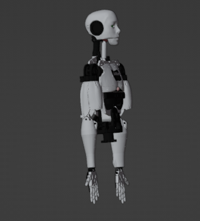
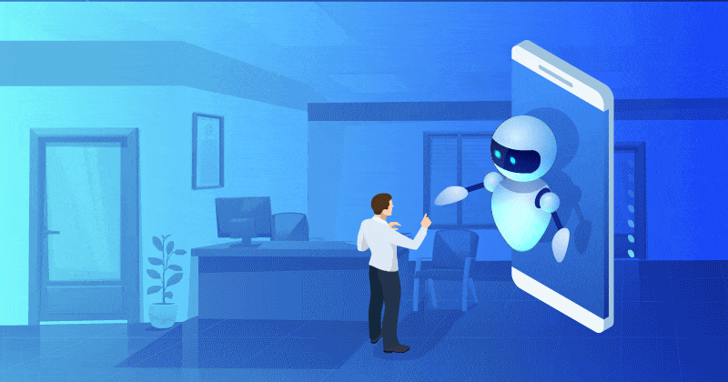

# Robot Niko
**Humanoid Robot Using Raspberry PI**


## Features:
<hr>


- [ ] **Robot Voice**
  - [ ] WakeWord
  - [X] Listening
  - [X] Speaking
  - [X] Custome conversation
  - [ ] Talking in **Bangali** Language 
  
<br>

- [ ] **Robot System Design**
  - [ ] Robot System Installer Script
  - [ ] Robot Service Installer Script 
  - [ ] Running System in Startup
  - [ ] Gui for Robot interfece
  - [ ] Setup Robot Operating System(ROS)

<br>

- [ ] **Robot Basic Functions**
  - [ ] Greetings
  - [ ] Searching Information
  - [ ] Capturing Images.
  - [ ] Predicts Time, Date, Weather Report etc. 
  - [ ] Say Jokes :grin:
  - [ ] Tells you latest news feeds.
  - [ ] Send an Email



<br>

- [ ] **Robot Mobility**
  - [ ] Go forward, backward, left and right using Wheel 
  - [ ] Object Avoiding Mode 
  - [ ] Human Following Mode 
  - [ ] Path planning
  - [ ] Mapping a location 
  
<br>

- [ ] **Robot Arm Movement**
  - [ ] Handsake 
  - [ ] Salute 
  - [ ] Hand's Up 
  - [ ] Picking Object
  - [ ] Other's arm move 

<br>

- [ ] **Advanced Machine Learning Features**
  - [ ] Object Detection
  - [ ] Image Detection
  - [ ] Image Recognition 
  - [ ] read Face Emotion
  - [ ] Gender Detection 
  - [ ] Mask Detection 

<br>



<br>

### Looking for contributors!
Looking for contributors to help build out the Robot. There are a lot of work to do. This would be a good oppurtunity to learn Robotics, ROS, Machine Learning and how to Engineer an entire Robot system from the ground up. You can add your any idea to our project.

<br>

### Contribution guidelines 
Follow these algorithms to contribute to the voice assistant project. 
- Fork this repository 
- Add your any idea to the project. Or 
- Select your comfortable issues given in issues feature [click here to see the issues](https://github.com/devjewel01/Robot-Niko).
- Try to solve the mentioned issues and make a pull request by using branch folder 🌿 .
- Stricly maintain the clear commit name and message.
- Make a pull request to this repository ❤

<br>

### Installation Robot System


```sh
git clone https://github.com/devjewel01/Robot-Niko
```
```sh
cd Robot-Niko/scripts
```
```sh
sudo chmod +x robot-installer.sh
```
```sh
sudo ./robot-installer.sh 
```


